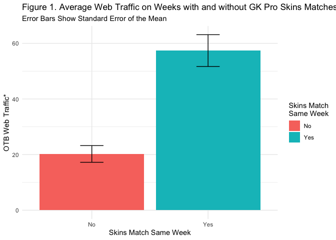
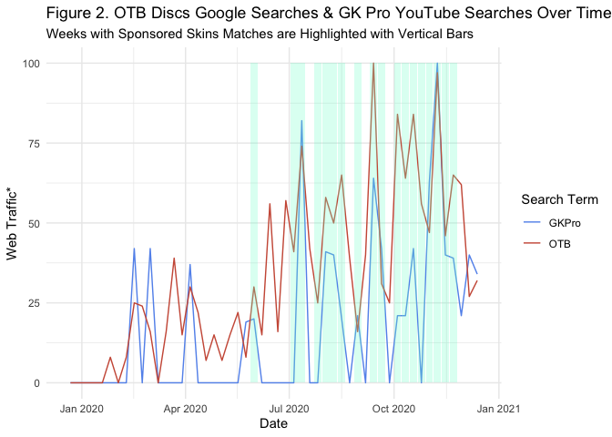
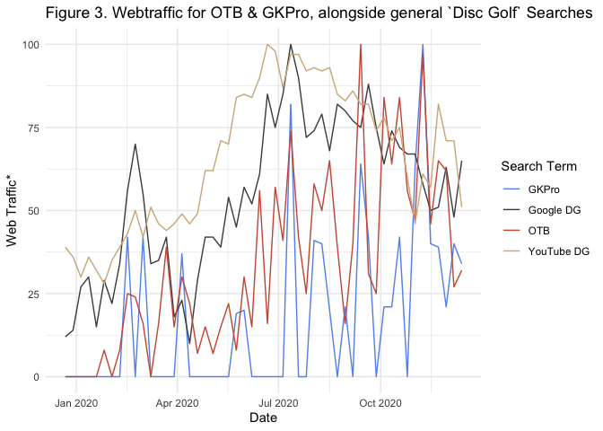

# Background 

With COVID-19 decreasing the amount of disc golf content in 2020, I found myself really watching a lot of "skins" matches hosted by GK Productions. [Here's a link to one of the last this season](https://www.youtube.com/watch?v=7T55QNlVaOc). \n

For those unfamiliar, these matches are more-or-less single-round match-play events. In this format, there is not an overall prize at the end; rather, players compete for cash prizes for taking the best (i.e., lowest) score on each hole. For example, if 3 of 4 players take par on hole 1, and only 1 player gets a birdie, that player gets $50. If 2 (or more) players tie the best score on a given hole, the cash "rolls over" to increase the value of the next hole. Typically, these are filmed around the time (and at the location of) a larger tournament or Disc Golf Pro Tour Event. They feature top pros showing their human side and are a blast to watch. \n

"Only The Best" Discs aka [OTB Discs](https://otbdiscs.com/) has sponsored these events all year, and they've offered free shipping on their products--on top of providing cash for the competitors--as a sponsorship promotion. I personally found myself fighting the urge to purchase a disc from them any time I watched a skins match (and often failed the urge). For that reason, I wanted to dive into the data and see what impact these had on OTB webtraffic. As a note, I would prefer to follow this up with sales data before being confident in any impact to their bottom line, but that's not publicly available. We should note that someone may look at OTB's website without purchasing anything.

# Method

## Data Sources: 

### [Google Trends](trends.google.com):

* This gave me search popularity for both Google and YouTube. 

* I compared Google's traffic for "OTB Discs" and "Only the best discs" (I merged the numbers for these) to YouTube's traffic for "GK Productions". 

* Here's what Google says this about the values they give on webtraffic: "Numbers represent search interest relative to the highest point on the chart for the given region and time. A value of 100 is the peak popularity for the term. A value of 50 means that the term is half as popular. A score of 0 means there was not enough data for this term."

### [GKPro's YouTube](https://www.youtube.com/channel/UC96v9uB8ZKe1TFdYzBOGnpw):

* While webtraffic tells me how much GK pro is searched in a week, it doesn't tell me if a sponsored skins match was released this week or not. 

* I manually checked all of the weeks and made a dichotomous (i.e., "Yes" or "No") variable to let me compare webtraffic for OTB on weeks with and without a skins match.  


## Analytic Plan:

1) Visually assess average web traffic for OTB on weeks with and without coverage (Figure 1 below).

2) Plot web traffic over time for googling OTB's website alongside people searching YouTube for GKPro (Figure 2 below).

3) Plot the same graph as 2, but adding in trends for searching YouTube and Google for "Disc Golf" generally. This helps us contextualize these rises and falls in OTB webtraffic with seasonal trends. We may expect more googling of OTB during the summer when more people play regardless of the videos (Figure 3 below).

4) Conduct a formal statistical analysis to see if the effect of a sponsored video significantly increased sales *through* GKPro videos, *controlling for* the direct effect of the sponsorship on OTB's website and seasonal fluxuations in searches of YouTube and Google for "Disc Golf". This goes one step farther than seeing if there is an association. It's tough to explain without statistical terms, but this is called "mediation" and it checks if the variation in the link from $Sponsorship --> GKPro_{webtraffic}$ is the same as the variation in $GKPro_{webtraffic} --> OTB_{webtraffic}$. In total this provides a formal test of if the entire path exists, i.e.: $Sponsorship --> GKPro_{webtraffic} --> OTB_{webtraffic}$. This value could be considered a minimum estimate of impact on webtraffic for sponsoring those videos.


To be clear, point #4 will be done *controlling for the variation of webtraffic for "Disc Golf" generally* in both YouTube and Google as a proxy for general disc golf popularity (although I know that's an imperfect proxy).

# Results & Discussion

## Significant Mean Differences (Step 1)


Figure 1 shows that OTB webtraffic is higher in weeks with a skins match (average webtraffic = 57.38), compared to weeks without a skins mathc (average webtraffic = 20.24). Because the standard error bars do not overlap, we can be confident that these are significantly different amounts of webtraffic


<!-- -->

##### *Note: From Google Trends: "Numbers represent search interest relative to the highest point on the chart for the given region and time. A value of 100 is the peak popularity for the term. A value of 50 means that the term is half as popular. A score of 0 means there was not enough data for this term."

## Trend over Time (Steps 2 & 3)

Since we have this nice time-ordered data, I plotted these trends over time. Figure 2 shows Google Searches for OTB Discs alongside YouTube Searches for GK Pro. I highlighted the weeks with sponsored skins matches. The closely coupled peaks and valleys between these lines suggest people may be Googling OTB more often during weeks with a GKPro sponsored skins match; just what we expected!\n

Something important to note here is that OTB actually sponsors other videos, too, so we'd expect some noise here from other videos that are not skins matches (i.e., other GK Pro videos that aren't skins matches, videos from their sponsored players, etc.). A better model would include those sources of variation, but I didn't want to scour the internet for all their sponsored players' videos.\n

We also see an early peak in the model that is before any sponsorsed skins match. A guess I have here is simply that this is the start of the professional disc golf season, and that watching professionial disc golf increases sales of discs. These early spikes that occur for both GK Pro and OTB are likely from the Las Vegas Challenge and the Memorial Championship, which both occured in those times.


<!-- -->
Figure 3 shows the same webtraffic plot, but with the increases in Google and YouTube searches for "Disc Golf" to account for seasonal changes in trends. The early spikes which weren't associated with sponsorship of a GK Pro match really seem to line up with seasonal trends. But the trends increase much higher than the sales. But later in the season, it looks like OTB sales went way up compared to the small bump they got from a general increase from the season's start.

<!-- -->

##### *Note: From Google Trends: "Numbers represent search interest relative to the highest point on the chart for the given region and time. A value of 100 is the peak popularity for the term. A value of 50 means that the term is half as popular. A score of 0 means there was not enough data for this term."\n

I used a package called `{lavaan}` to do some inferential statistics to make sure these trends were significant. I was worried about having so few data points, so I actually did something called "bootstrapping" where I made a statistical model and then simulated the results 5000 times. The 5000 estimates are then used to give some confidence in your findings. This is a huge oversimplification, but I wanted to spare you the details.\n

## Inferential Statistics Results (Step 4)

With 95% confidence, we can say that GK Pro videos increase webtraffic for OTB, *even controlling for seasonal variation in disc golf popularity*. Statistically, we can divide up the influence of these sponsored videos on OTB web traffic into: 

* variability that is "carried through" the GK Pro videos' variability, and
* unique influence that is not carried through it. 

You can think of the unique variation as "random noise" that we control for, and the "carried through" variability as the  effect of these sponsored videos *through* GK Pro webtraffic to OTB's webtraffic. There are explanations for the direct path that are not random noise, but if we're interested in the mediated effect, this is noise to us. If the effect is in fact carried through GK Pro, we'd expect this to not be significant. \n

However, one possibility I see is if YouTube recommended a GK Pro video, they won't actually type it on YouTube, so the direct increase on OTB would look to occur without increased searching of "GK Pro". I'll ignore this unless this path is significant, but I don't expect that \n

## Quantifying the Increase: Is it significant?

### Impact of number of GK Pro Searches on OTB Searches

The model shows that an increase in GK Pro viewership by 1% of their relative webtraffic corresponds to an increase of about 0.43% (95% confidence range = 0.14-0.70). This change is significant and is not small. If GK pro webtraffic went up by 50%, we would see about 21.5% increase on OTB webtraffic. I don't know the scale of either of their webtraffic, but this seems like a substantial increase. Visually, this is $GKPro_{webtraffic} --> OTB_{webtraffic}$.

### Impact of OTB Sponsored Skins Match on GK Pro Searches

GK Pro is also (probably) feeling this benefit: if we compare the weeks with sponsored videos to weeks without, their webtraffic is up 28% (95% confidence range = 14.02-42.93) on weeks with sponsored videos compared to weeks without sponsored videos! This is visually $Sponsorship --> GKPro_{webtraffic}$ . The researcher in me knows that this value is conflated with lots of spurrious associations we cannot assess, however, this estimate *is* controlling for the popularity of "Disc Golf" searches on both YouTube and Google during those weeks. With GK Pro being sponsored most weeks, though, it seems like their popularity may just rise and fall with release of a video (duh!), but that relies on *someone* sponsoring it (and it happens to be OTB). \n

### The impact of Skins Match Sponsorship on OTB Searches *through* GK Pro Searches

This is what we are most interested in; it is the minimum impact that is actually felt by OTB *through* GK Pro. Only variation which is consistent through both variables is accounted for here. Visually, it looks like:

$$Sponsorship --> GKPro_{webtraffic} --> OTB_{webtraffic}$$
This is the "mediated" effect we're interested in. In essence, OTB is boosting their own webtraffic by 12.20% (95% confidence range = 2.64-26.6%) for every video they sponsor. They can use this to determine how "worth it" these videos are to them. \n

### Total Impact of Sponsorship on OTB webtraffic (i.e., overall association)

It is worth noting that when we control for YouTube and Google searches for "Disc Golf" and the searches for GK Pro, we see no direct effect of sponsorship on OTB searches. This likely means that most people searching OTB are doing so *because of GK Pro*.

# Appendix for Those Interested in Analytic Details:

I included minimal output from the regression below, and you can see it's significant if the `ci.lower` and `ci.upper` have the same term (i.e., - or +), which represent a range of confidence in our findings at 95%. The defined parameter "mediated_effect" is the product of the paths a*b, which is the most common way to formally test mediation in structural equation modeling.


```r
mediation_mod1 <- '
total_otb ~ a*gk_pro_united_states + d*sponsored + Google_DG + YouTube_DG

gk_pro_united_states ~ b*sponsored+ Google_DG + YouTube_DG

mediated_effect := a*b
'

med_fit_boot<- sem(mediation_mod1, 
                   data = dat, 
                   estimator = "ML",
                   se = "bootstrap", 
                   bootstrap = 5000,
                   parallel = c("multicore"))

table <- parameterEstimates(med_fit_boot, 
                   level = .95, 
                   boot.ci.type = "perc", 
                   output = "pretty", 
                   stand = T) #adjusted bootstrap percentile (BCa) method,but with no correction for acceleration (only for bias).

table %>% 
  select(-c(se:pvalue), 
         -c(std.lv:std.nox)
         ) %>% 
  filter(op!='~~')
```

```
## 
## Regressions:
##                          Estimate ci.lower ci.upper
##   total_otb ~                                      
##     gk_pr_ntd_ (a)          0.431    0.146    0.699
##     sponsored  (d)         14.476   -2.415   29.171
##     Google_DG               0.163   -0.148    0.464
##     YouTube_DG              0.292   -0.038    0.666
##   gk_pro_united_states ~                           
##     sponsored  (b)         28.326   13.912   43.055
##     Google_DG               0.328   -0.058    0.687
##     YouTube_DG             -0.358   -0.740    0.066
## 
## Defined Parameters:
##                    Estimate ci.lower ci.upper
##     mediated_effct   12.196    2.667   26.357
```
